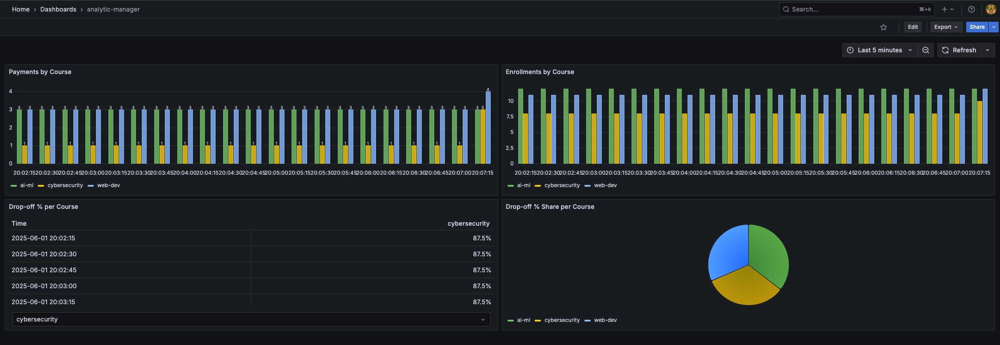
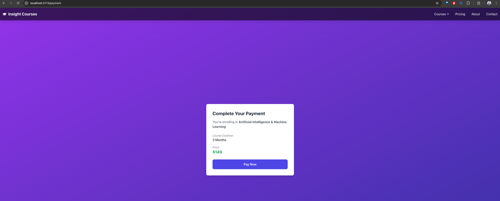
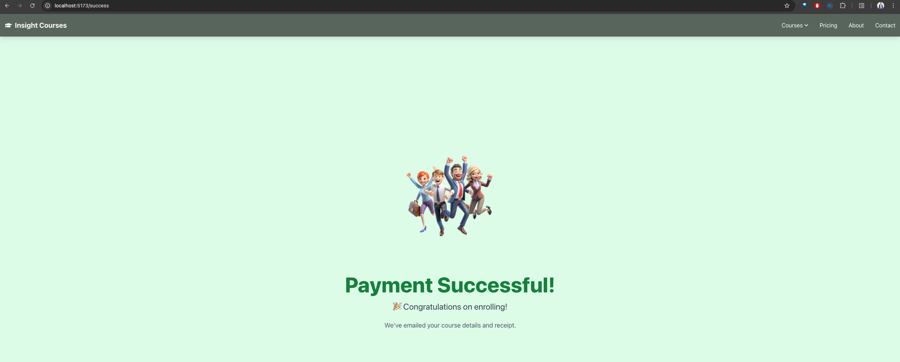

# AnalyticManager

A lightweight, pluggable analytics manager for tracking user interactions and drop-off rates across any web-based application.

---

## 🚀 Overview

**AnalyticManager** helps developers monitor and analyze user behavior (like button clicks, funnel drop-offs, etc.) in real-time using:

* **Spring Boot** (Producer/Consumer event pipeline)
* **Prometheus & Grafana** (Monitoring & Dashboards)
* **React** (Frontend UI Integration)

You can use this in any domain (e.g., e-learning, e-commerce, SaaS) to understand where users drop off or how they engage.

---

## 📦 Tech Stack

* **Frontend**: React.js (User Events Reporter)
* **Backend**: Spring Boot (Kafka-style Producer & Consumer)
* **Monitoring**: Prometheus + Grafana

---

## 📁 Project Structure

```
analytic-manager/
├── backend/               # Spring Boot microservices
│   ├── producer/          # Receives and pushes events
│   └── consumer/          # Processes and stores metrics
├── frontend/              # React app to simulate user events
├── monitoring/            # Prometheus + Grafana setup
└── README.md
```

---

## ⚙️ Features

* Track clicks, views, form interactions
* Detect and analyze drop-off between steps (e.g., Enroll → Payment)
* Monitor metrics via Prometheus
* Visualize behavior with Grafana dashboards
* Plug-and-play setup for any new project

---

## 🛠️ Setup Instructions

### 1. Clone the Repo

```bash
git clone https://github.com/your-username/analytic-manager.git
cd analytic-manager
```

### 2. Run Backend (Spring Boot)

```bash
cd backend/producer
./mvnw spring-boot:run

cd ../consumer
./mvnw spring-boot:run
```

### 3. Run Frontend (React)

```bash
cd frontend
npm install
npm start
```

### 4. Run Monitoring Tools

```bash
cd monitoring
# Start Prometheus & Grafana using Docker Compose
docker-compose up -d
```

---

## 📊 Sample Use Case: Course Funnel Drop Analysis

Track users who click "Enroll" but don't complete payment. Events:

* `ENROLL_CLICKED`
* `PAYMENT_SUCCESS`
* Drop rate = users with ENROLL\_CLICKED - PAYMENT\_SUCCESS

---

## 🔌 Integration

You can easily integrate this manager into any app by:

* Sending events via a simple HTTP API (POST `/track-event`)
* Defining new event types as needed

---

## 📈 Dashboards

Grafana dashboards are auto-configured to display:

* Event frequency over time
* Funnel drop-offs
* Custom filters for event source, user type, etc.

---

## 🌟 Quick Run in Local

### 1. SSH into the Ubuntu VM from macOS

```bash
ssh prakash@198.168.26.227
```

---

### 2. Start Zookeeper and Kafka (as `kafka` user)

```bash
su -l kafka

# From kafka directory:
bin/kafka-server-start.sh config/server.properties
sudo bin/zookeeper-server-start.sh config/zookeeper.properties
```

---

### 3. Run Spring Boot Application

Run the [analytic-manager](https://github.com/prakash144/analytic-manager) Spring Boot app locally or in the VM.

---

### 4. Start Prometheus and Grafana Services (on VM)

```bash
sudo systemctl start prometheus
sudo systemctl start grafana-server
```

---

### 5. Port Forwarding: Access Prometheus and Grafana from Mac Browser

From your **Mac terminal**, run:

```bash
# Prometheus
ssh -L 9090:localhost:9090 prakash@192.168.29.226

# Grafana
ssh -L 3000:localhost:3000 prakash@192.168.29.226
```

Then open in browser:

* [http://localhost:9090](http://localhost:9090) → Prometheus
* [http://localhost:3000](http://localhost:3000) → Grafana

---




---

## 🤝 Contributing

Contributions are welcome! Please open issues or submit PRs.

---

## 📬 Contact

* 🌐 Website: [www.prakashrabidas.in](https://www.prakashrabidas.in)
* 🔗 LinkedIn: [Prakash Rabidas](https://www.linkedin.com/in/prakashrabidas/)

---

Happy Tracking! 🎯
